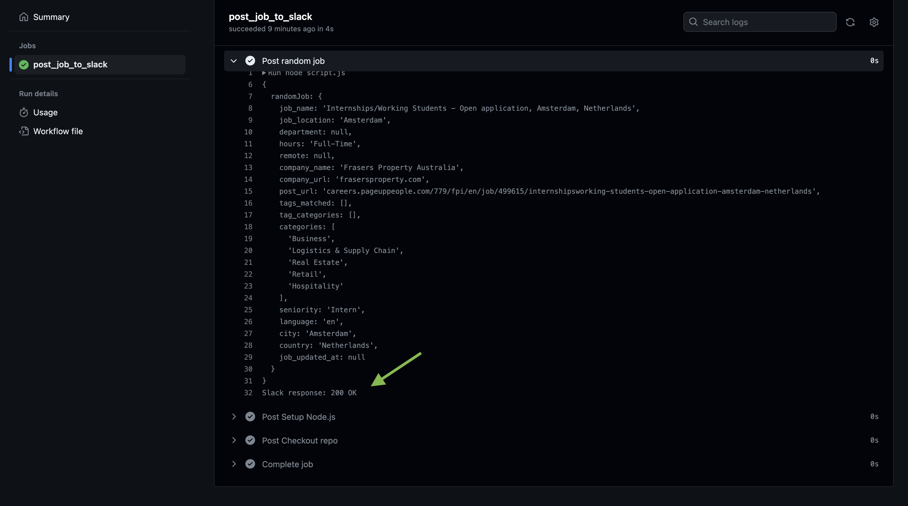
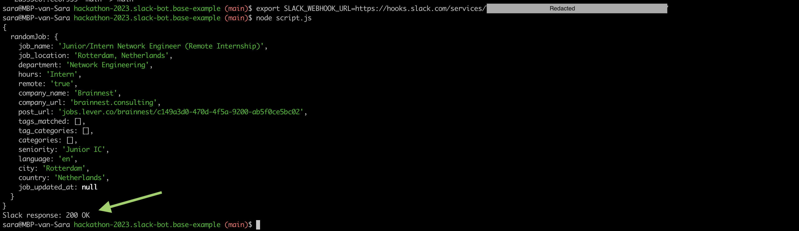

# hackathon-2023.slack-bot.base-example

This is a Slack bot that posts a random job listing to a Slack channel every 5 minutes. The job listings are sourced from a JSON file containing data about various job postings. This bot is useful for keeping people informed about available job opportunities and providing exposure to various roles.

The bot is written in JavaScript and runs on Node.js. It uses a webhook URL to post messages to Slack, and can be customized to fit different job listing data sources or Slack channels.

## Table of Contents

- [Prerequisites](#prerequisites)
- [Installation](#installation)
    - [Forking the repository](#forking-the-repository)
    - [Cloning the repository](#cloning-the-repository)
    - [Installing dependencies](#installing-dependencies)
    - [Add the SLACK_WEBHOOK_URL secret to your repository](#add-the-slack_webhook_url-secret-to-your-repository)
- [Usage](#usage)
    * [Inspect the GitHub Action execution logs](#inspect-the-github-action-execution-logs)
    * [Run the script.js directly from your local machine](#run-the-scriptjs-directly-from-your-local-machine)
- [How this project works](#how-this-project-works)
    * [Scheduled GitHub Workflow](#scheduled-github-workflow)
    * [The scheduled script written in JavaScript](#the-scheduled-script-written-in-javascript)
- [Contributing](#contributing)
- [License](#license)

## Prerequisites

Before you can install, use this project and add extra functionalities to it, you need to have the following prerequisites and software installed on your computer:

- **A personal GitHub account**. If you don't already have one, you can sign up for free [here](https://github.com/).
- **Git**: this is a version control system that allows you to manage and track changes to your code. You can download and install Git from the official website [here](https://git-scm.com/downloads).
- **A terminal**: this is the application that allows you to enter commands into your computer. You can use the default terminal on your operating system, or install a third-party terminal such as [iTerm2](https://iterm2.com/) for macOS or [Windows Terminal](https://aka.ms/terminal) for Windows.
- **A code editor**: this is the application that allows you to write and edit code. You can use any code editor of your choice, such as [Visual Studio Code](https://code.visualstudio.com/), [Atom](https://atom.io/), or [Sublime Text](https://www.sublimetext.com/).
- **JavaScript**: this is the programming language used in this project. You don't need to install it separately, as it comes pre-installed with most web browsers.
- **A Slack webhook URL**: this is a special URL that allows your code to send messages to a Slack channel. For instructions on setting up a webhook URL, please refer to the Slack documentation.For more detailed instructions on setting up a webhook URL, please refer to the [Slack documentation](https://api.slack.com/messaging/webhooks).

Once you have all of these prerequisites, you're ready to move on to the installation steps.

## Installation

To install and being able to use this Slack bot, you need to fork this repository to your own GitHub account and then clone your forked repository to your local machine.

### 1) Forking the repository

Here are the steps to fork the repository:

1. Go to the repository page on GitHub: [https://github.com/shesharpnl/hackathon-2023.slack-bot.base-example](https://github.com/shesharpnl/hackathon-2023.slack-bot.base-example).  

2. Click the "Fork" button in the top right corner of the repository page. This will create a copy of the repository in your own GitHub account.

### 2) Cloning the repository

Here are the steps to clone your forked repository to your local machine:

1. Once you have forked the repository, navigate to the forked repository on your GitHub account: [https://github.com/YOUR_USERNAME/hackathon-2023.slack-bot.base-example](https://github.com/YOUR_USERNAME/hackathon-2023.slack-bot.base-example). Replace `YOUR_USERNAME` with your GitHub username.

2. Click the "Code" button and copy the HTTPS or SSH link to the repository.

3. Open your terminal and navigate to the directory where you want to store the project. For example: `cd ~/projects`.

4. Type `git clone` followed by the repository link you copied earlier, then press Enter (remember to replace `YOUR_USERNAME` with your GitHub username):

```
git clone https://github.com/YOUR_USERNAME/hackathon-2023.slack-bot.base-example.git
```

5. Press Enter again to execute the command. This will download the repository to your local machine. If you are cloning the repository using HTTPS, you may be prompted to enter your GitHub username and password. 
If you are cloning the repository using SSH, you will need to set up authentication via SSH. You can find instructions for doing so [here](https://docs.github.com/en/authentication/connecting-to-github-with-ssh). Once you have set up authentication via SSH, you can clone the repository using the SSH URL.

### 3) Installing dependencies

For this project, you don't need to install any extra dependencies (no need to run `npm install` or similar commands). Nice!

### 4) Add the SLACK_WEBHOOK_URL secret to your repository

1. First, go to your forked repository on GitHub ([https://github.com/YOUR_USERNAME/hackathon-2023.slack-bot.base-example](https://github.com/YOUR_USERNAME/hackathon-2023.slack-bot.base-example)) and click on the `Settings` tab.

2. On the left sidebar, click on `Secrets`.

3. Click on the `New repository secret` button.

4. In the `Name` field, enter `SLACK_WEBHOOK_URL`.

5. In the `Value` field, enter the URL of your Slack webhook. If you don't have a Slack webhook, follow these instructions to create one: https://api.slack.com/messaging/webhooks.

6. Click on the `Add secret` button to save your new secret.

That's it! Now the GitHub Workflow in your forked repository should be able to use the `SLACK_WEBHOOK_URL` secret to post job data to Slack.

## Usage

This is how the Slack bot messages will look like:


### Inspect the GitHub Action execution logs

To verify that the project works by looking at the GitHub Actions logs, you can follow these steps:  

1. Go to your forked repository on GitHub and click on the "Actions" tab.
2. You should see the `Post random job on Slack every 5 minutes` workflow listed. Click on it to view the details.
3. In the "Jobs" section, you should see a job called `post_job_to_slack`. Click on it to view the details of that job.
4. In the job details, you should see a list of steps that were executed. The last step should be `Post random job`. Click on that step to view its logs.
5. In the logs, you should see the output of the script that was executed. Look for the line that says `Slack response: 200 OK`. This indicates that the script was able to successfully post the job to Slack.
6. You can also look for any error messages in the logs to identify any issues that may have occurred during the execution of the script.

You should be able to see something like this:



If you encounter any issues, you can try the following steps to troubleshoot:  

1. Check that the `SLACK_WEBHOOK_URL` secret has been added to your forked repository as described in the previous section.
2. Make sure that the URL for the JSON file containing job data is correct and accessible.
3. Verify that the Slack webhook URL is valid and active.
4. Check that the script is correctly configured and all dependencies have been installed.
5. Review the logs for any error messages that may provide more information about the issue.

### Run the script.js directly from your local machine

Running the script locally allows you to test and debug the script without having to commit and push changes to the GitHub repository, which can save time and make the development process more efficient. It also allows you to test the script using different data or configurations that may not be available in the GitHub environment.

How to run the `script.js` file locally:  

1. Open your terminal and navigate to the cloned repository:
```
cd hackathon-2023.slack-bot.base-example
```
2. In your terminal, set the `SLACK_WEBHOOK_URL` environment variable to the copied webhook URL:
```
export SLACK_WEBHOOK_URL=<copied-webhook-url>
```
Note: This step is only for Unix-based systems. If you're using Windows, you can set the environment variable using the System Properties window.
3. Run the script by running:
```
node script.js
```
This will fetch job data from the specified URL, generate a Slack payload based on a random job, and post the payload to the incoming webhook URL you set up in the previous steps.

That's it! You should now be able to run the script and post a random job to the Slack channel.



## How this project works

### Scheduled GitHub Workflow

GitHub Workflows are a feature of GitHub Actions that allow developers to create custom workflows that are triggered by specific events or scheduled to run at specific times. In this project, a scheduled workflow is used to run the bot every 5 minutes. This workflow is defined in a YAML file and specifies the job that needs to be run and when it should be run.

To learn more about GitHub Actions and Workflows, you can check out the official documentation:

**GitHub Actions**: https://docs.github.com/en/actions  
**GitHub Workflows**: https://docs.github.com/en/actions/reference/workflow-syntax-for-github-actions    

Let's have a look at the GitHub Workflow used as part of this project.  
You can find the GitHub workflow here: `.github/workflows/post-to-slack.yaml`.

```yaml
name: Post random job on Slack every 5 minutes
```
This line defines the name of the workflow. In this case, the workflow is called `Post random job on Slack every 5 minutes`.    

```yaml
on:
  schedule:
    - cron:  '*/5 * * * *'
```
This section specifies when the workflow should be triggered. In this case, the workflow is triggered on a schedule using the [cron syntax](https://cron.help/), which means it will run every 5 minutes.    

```yaml
jobs:
  post_job_to_slack:
    runs-on: ubuntu-latest
    steps:
      - name: Checkout repo
        uses: actions/checkout@v2
```
This section defines the job that will be run by the workflow. The job is called `post_job_to_slack` and it will run on an Ubuntu environment. The first step in the job checks out the repository that contains the workflow.    

```yaml
      - name: Setup Node.js
        uses: actions/setup-node@v2
        with:
          node-version: '18'
```
This step sets up Node.js on the environment by using the `actions/setup-node` action. It specifies that Node.js version 18 should be used.    

```yaml
      - name: Post random job
        run: node script.js
        env:
          SLACK_WEBHOOK_URL: ${{ secrets.SLACK_WEBHOOK_URL }}
```
This step runs the `script.js` file in the project, which will post a random job to Slack using the `SLACK_WEBHOOK_URL` environment variable. The value of the `SLACK_WEBHOOK_URL` environment variable is retrieved from the [GitHub repository's secrets](#4-add-the-slack_webhook_url-secret-to-your-repository).    

In summary, this GitHub Actions file sets up a job that runs every 5 minutes on an Ubuntu environment, sets up Node.js version 18, checks out the repository, and runs a script that posts a random job to Slack using the `SLACK_WEBHOOK_URL` environment variable.

### The scheduled script written in JavaScript

You can find the JavaScript file here: `script.js`.  
This JavaScript file is used in the GitHub workflow to post a random job to a Slack channel.  

The JavaScript file contains three functions:

- `getRandomJob(jobs)`: This function takes an array of jobs and returns a random job from the array.

- `generateSlackPayload(job)`: This function takes a job object and generates a Slack payload using a Slack block kit. The payload contains the job name, and the color of the attachment is set to `#00b29a`.

- `postJobToSlack(webhookUrl, payload)`: This function takes a webhook URL and a payload and posts the payload to the Slack channel using a `fetch()` request. 


## Contributing

Contributions to this project are welcome! If you find a bug, have a feature request, or want to contribute code, please follow these guidelines:

1. Fork the repository and clone it to your local machine.
2. Create a new branch for your changes: `git checkout -b my-branch-name`
3. Make your changes, and test them thoroughly.
4. Commit your changes with a descriptive commit message.
5. Push your changes to your forked repository: `git push origin my-branch-name`
6. Open a pull request against the main branch of this repository, explaining the changes you've made and why they are important.

Note that this project uses GitHub Actions to automatically post a random job to a Slack channel every 5 minutes, based on data fetched from a remote JSON file. If you want to contribute with new job postings, please add it to the appropriate JSON file in the `assets` directory and submit a pull request.

Thank you for your contributions!

## License

This project is licensed under the Apache License 2.0 - see the [LICENSE](LICENSE) file for details.